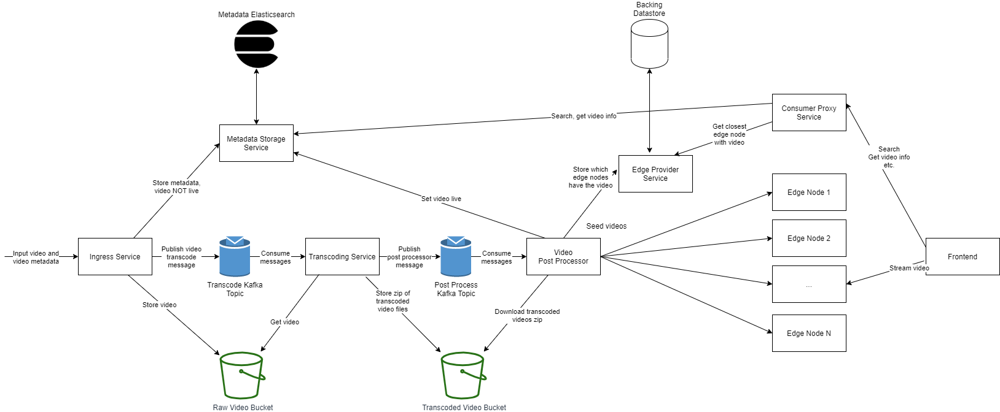

# Notflix
An over-engineered, highly scalable, video streaming platform. The goal behind Notflix was to both emulate the highly scalable architecture of giant video streaming platforms while also having a usable product that is built on top of various different technologies that excel in their respective use cases. This leads to Notflix being incredibly bulky to try and run for an individual user, but it will scale very flexibly for any given load.

As a side note, although I don't usually prefer it, Notflix uses a monorepo due to the extreme use of microservices and ease with which docker-compose allows you to run all of them.

## Tenets
1. Scalability should be flexible
2. Everything should be configurable
3. Video playback should adapt to the capabilities of the device

## Usage

First, you can spin up the whole stack by using docker compose (add a `-d` to the end if you don't want to see all the logs):
```
$> docker-compose up
```

To stop the stack at any time run:
```
$> docker-compose down
```

To start using the Notfilx platform, simply navigate a browser to http://localhost:3000. You'll immediately notice that it's pretty empty with no videos to play. To import a video, go to the ingress page and upload a video and select the transcoding settings you want to use. Once the video has finished processing it'll appear in the main search page and be ready to watch at whatever transcoding quality best fits the performance of your device.

## Architecture



### IngressService
IngressService takes raw video files, kicks off the transcoding process and stores metadata about the video. It accomplishes transcoding by uploading the raw video to S3 and publishing a Kafka message with the video's location and information about how to transcode the video (bitrate, resolution, etc.). Finally, it stores the metadata in MetadataStorageService so it can be searched later. 

### TranscodingService
TranscodingService process raw videos received through ingress and transcodes them into various resolutions and bitrates for playback later. It then pushes out the finished videos to be distributed to edge nodes. Specifically, it consumes messages from a Kafka topic (`transcode` by default) which contain the necessary information to download the raw video from S3 and transcode it to given resolutions and bitrates. Once transcoding is finished, it zips the various media files and uploads it back to S3. It finally publishes a Kafka message (the `post-transcode` topic by default) to notify downstream services to distribute the video for playback.

### MetadataStorageService
MetadataStorageService is essentially just a data access layer around Elasticsearch. It's in charge on maintaining settings for Elasticsearch indices as well as passing search and store requests to the cluster. It stores video metadata from ingress and handles consumer search requests.

### VideoPostProcessor
VideoPostProcessors handles all the necessary details to make a video live once it's been transcoded. As of right now, that means marking a video as live in search and seeding the video artifacts out to edge nodes. This is achieved by consuming a Kafka topic (`post-transcode` by default) which contains information about the video. In this implementation, seeding to the "CDN" is handled by ssh-ing into each node and copying the video files over. Once seeding in completed, the video is set to live so it appears in search results by calling MetadataStorageService.

### Edge Nodes
The edge node implementation is kind of dumb and in most real applications it would probably make sense to use an existing CDN. With that said, the edge nodes defined here are meant to replicate running your own CDN. They're just static file servers running nginx with CORS enabled. They have ssh enabled to allow EdgeSeederService to push new videos to them.

### EdgeNodeProviderService
EdgeNodeProviderService handles storage of which edge nodes have which videos as well as finding the closest edge node to a given user. This again could be handled by a managed CDN offering, but I both wanted this to run locally and didn't want to spend money on managed services.

### ConsumerProxyService
ConsumerProxyService is a glorified reverse proxy that handles routing from external services into our microservice infrastructure. It use express instead of just a traditional reverse proxy because it will allow us to collect one external call into multiple internal calls.

### notflix-frontend
There's nothing really special about notflix-frontend. It's a React app for watching videos that have been processed by the aforementioned pipeline.

## Technologies

### Docker and Docker Compose
Since I wanted to use a decent number of microservices, manually managing all of these services would quickly become tedious. Docker compose solves this issue by allowing me to describe the full infrastructure in the `docker-compose.yaml` file and then starting and stopping the whole stack with a single command.

### Kafka
Kafka allows for extremely flexible scaling of different parts of different services simply by spinning up more instances. It's due to this ease of scaling that a lot of internal worker services produces and consume messages from Kafka.

### Elasticsearch
I wanted real time search like what you see on the Notflix homepage. Elasticsearch is the industry standard for fast and scalable search so that's why I'm using it. For a small number of videos, a traditional RDBS like postgresql would work fine, but Elasticsearch allows for much more powerful search features for future expansion as well as much better scaling with these more complicated searches.

### Python and Node
The implementation languages of the various services were mostly chosen for my comfort with Python and Javascript. Additionally, Python works really well for scripting host tasks (like invoking `ffmpeg` and `MP4Box` like is done in TranscodingService). Contrary to popular belief, Express, the web framework used in Node, is highly scalable and can handle a large number of concurrent requests. Furthermore, for asynchronous tasks, like a lot of the web services do, Javascript async/await is the most ergonomic implementation I've found.

### React
No real argument about scalability here. As far as frontend frameworks go, I like React and it's the most common industry web framework--that's pretty much the extent of my reasoning behind choosing it.

## Notes
* Yes I included the ssh key for EdgeNode in the repository, no I don't actually use that key for anything personally. If you expose EdgeNode's ssh port to the internet please, please, please generate your own key, this one is certainly not secure.

## Todo
* iOS doesn't support playing Dash files, so currently this doesn't work on iOS. The planned solution is to also create HLS manifests during transcoding and the frontend will automatically choose between Dash and HLS depending on the device.

* The whole user Ingress flow needs to be developed. As of right now the "Ingress Service" is a Python script that requires manual editing to actually do anything useful.

* TranscodingService needs support for multiple resolutions as well as bitrates. It currently keeps the source resolution and just transcodes to the desired bitrate.
